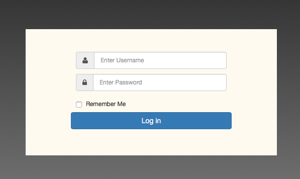
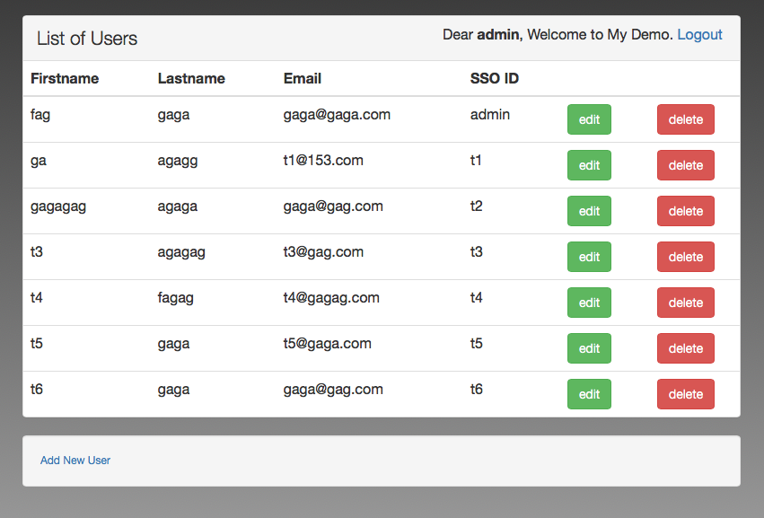
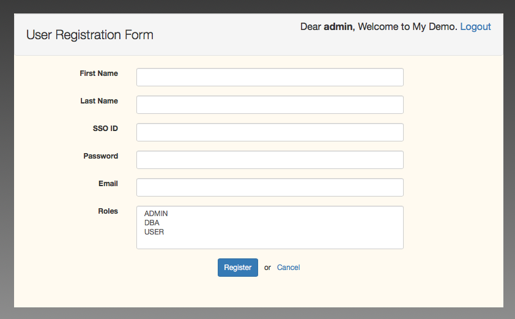
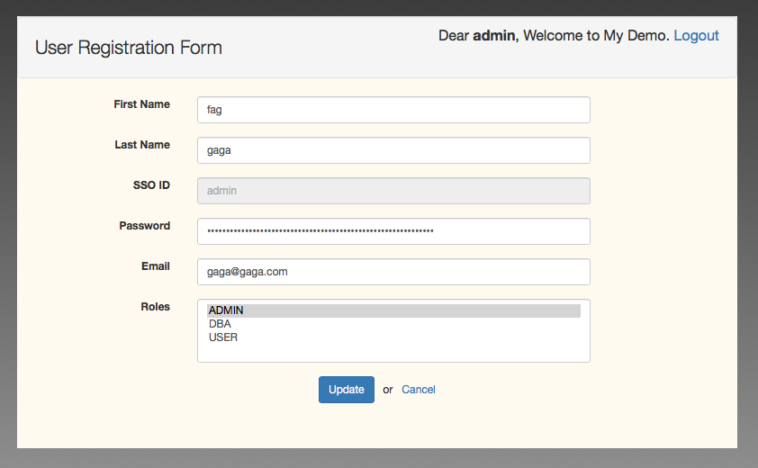

# 介绍
参考源码： http://websystique.com/springmvc/spring-mvc-4-and-spring-security-4-integration-example/

原有demo使用了 spring mvc4 + hibernate4 + spring security, 现在原来的基础上添加了 spring session，以支持分布式session。 session 信息记录在redis中，redis可以使用单点，也可以使用集群。

## 使用的技术栈
        
    spring 4.3.1
    spring mvc 4.3.1
    spring security 4.1.1
    spring session 1.3.1
    hibernate 4.3.11

## 环境依赖    
### 依赖Mysql

    docker run -idt --name mysql -p 3306:3306 -v ~/work/docker/config/mysql/my.cnf:/etc/mysql/conf.d/my.cnf -v ~/work/docker/data/mysql:/var/lib/mysql -e MYSQL_ROOT_PASSWORD="root" -e MYSQL_DATABASE="hedwig" mysql:5.7
    
    mysql配置文件my.cnf：
        [mysqld]
        lower_case_table_names=1
        default-storage-engine=INNODB
        character-set-server=utf8
        collation-server=utf8_general_ci
        [client]
        default-character-set=utf8
        
数据库初始化：

    /*All User's gets stored in APP_USER table*/
    create table APP_USER (
       id BIGINT NOT NULL AUTO_INCREMENT,
       sso_id VARCHAR(30) NOT NULL,
       password VARCHAR(100) NOT NULL,
       first_name VARCHAR(30) NOT NULL,
       last_name  VARCHAR(30) NOT NULL,
       email VARCHAR(30) NOT NULL,
       PRIMARY KEY (id),
       UNIQUE (sso_id)
    );
      
    /* USER_PROFILE table contains all possible roles */ 
    create table USER_PROFILE(
       id BIGINT NOT NULL AUTO_INCREMENT,
       type VARCHAR(30) NOT NULL,
       PRIMARY KEY (id),
       UNIQUE (type)
    );
      
    /* JOIN TABLE for MANY-TO-MANY relationship*/  
    CREATE TABLE APP_USER_USER_PROFILE (
        user_id BIGINT NOT NULL,
        user_profile_id BIGINT NOT NULL,
        PRIMARY KEY (user_id, user_profile_id),
        CONSTRAINT FK_APP_USER FOREIGN KEY (user_id) REFERENCES APP_USER (id),
        CONSTRAINT FK_USER_PROFILE FOREIGN KEY (user_profile_id) REFERENCES USER_PROFILE (id)
    );
    
    /* Create persistent_logins Table used to store rememberme related stuff*/
    CREATE TABLE persistent_logins (
        username VARCHAR(64) NOT NULL,
        series VARCHAR(64) NOT NULL,
        token VARCHAR(64) NOT NULL,
        last_used TIMESTAMP NOT NULL,
        PRIMARY KEY (series)
    );
     
    /* Populate USER_PROFILE Table */
    INSERT INTO USER_PROFILE(type)
    VALUES ('USER');
     
    INSERT INTO USER_PROFILE(type)
    VALUES ('ADMIN');
     
    INSERT INTO USER_PROFILE(type)
    VALUES ('DBA');
     
     
    /* Populate one Admin User which will further create other users for the application using GUI */
    /* default userName/password is:  sam/abc125 */
    INSERT INTO APP_USER(sso_id, password, first_name, last_name, email)
    VALUES ('sam','$2a$10$4eqIF5s/ewJwHK1p8lqlFOEm2QIA0S8g6./Lok.pQxqcxaBZYChRm', 'Sam','Smith','samy@xyz.com');
     
     
    /* Populate JOIN Table */
    INSERT INTO APP_USER_USER_PROFILE (user_id, user_profile_id)
    SELECT user.id, profile.id FROM app_user user, user_profile profile
    where user.sso_id='sam' and profile.type='ADMIN';
    
### 依赖redis:

    docker run --name redis -p 6379:6379 -d redis:4.0.2-alpine redis-server --appendonly yes
    
### 环境变量配置
可以通过给予环境变量(env)的方式对 mysql 与 redis 连接信息进行配置：

| 变量名称 | 说明  | 示例 |
| :-------- | :----- | :------ | 
| MYSQL_URL | mysql的连接地址 | jdbc:mysql://localhost:3306/gkdemo |
| MYSQL_USERNAME  |  mysql的用户名 | root |
| MYSQL_PASSWORD  |  mysql的用户密码 | root    |
| REDIS_CLUSTER  |  redis是否为集群 |  false    |
| REDIS_HOST_NAME  | 非集群时，redis主机名或ip地址  |  localhost 或者 127.0.0.1  |
| REDIS_HOST_PORT  | 非集群时，redis端口  |  6379  |
| REDIS_SENTINEL_NODES  | 集群时，哨兵的地址，多个之间用逗号分隔  |  127.0.0.1:6470,127.0.0.1:6471,127.0.0.:6472 |
| REDIS_PASSWORD  | redis密码  |  123456   |
    
## 界面预览    
登陆页面：

  
  
列表页面

  

新增

  
  
更新

  